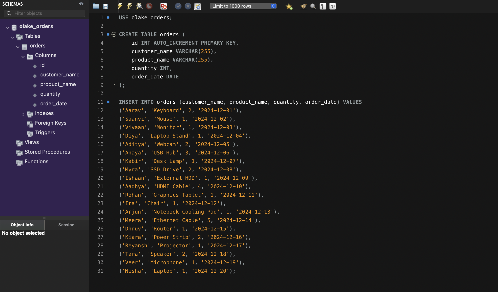
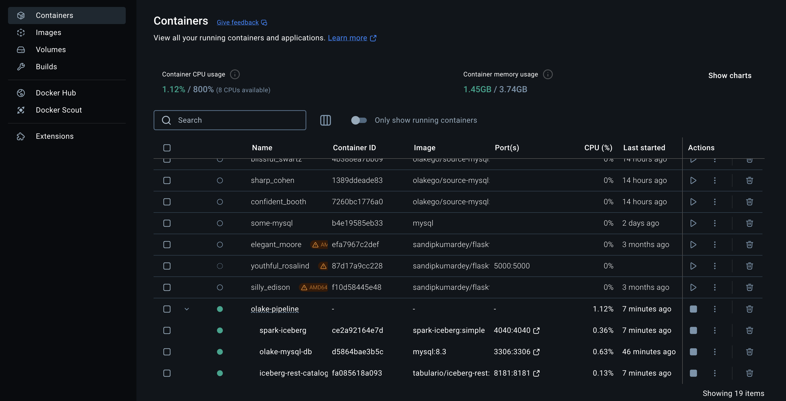
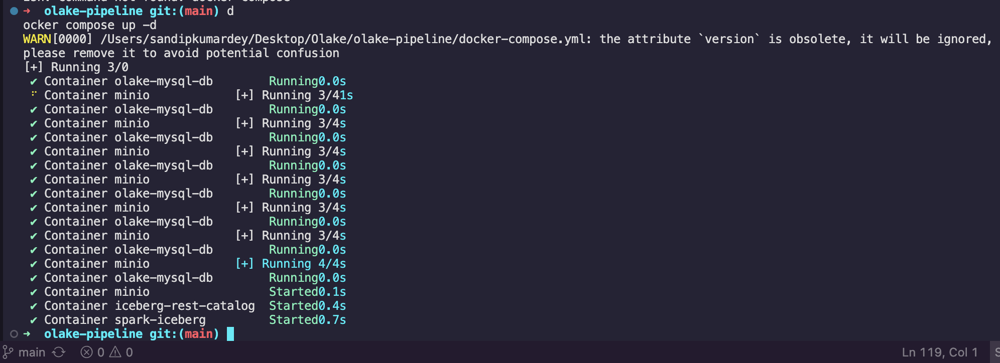
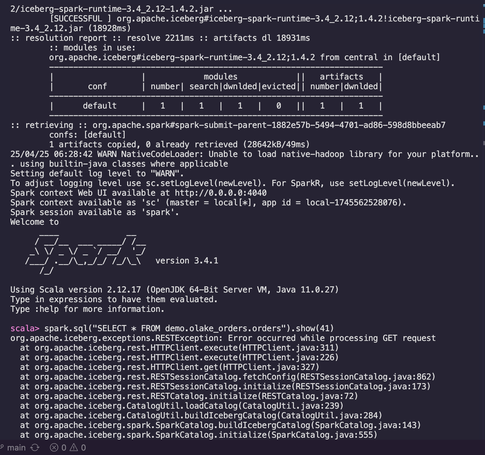
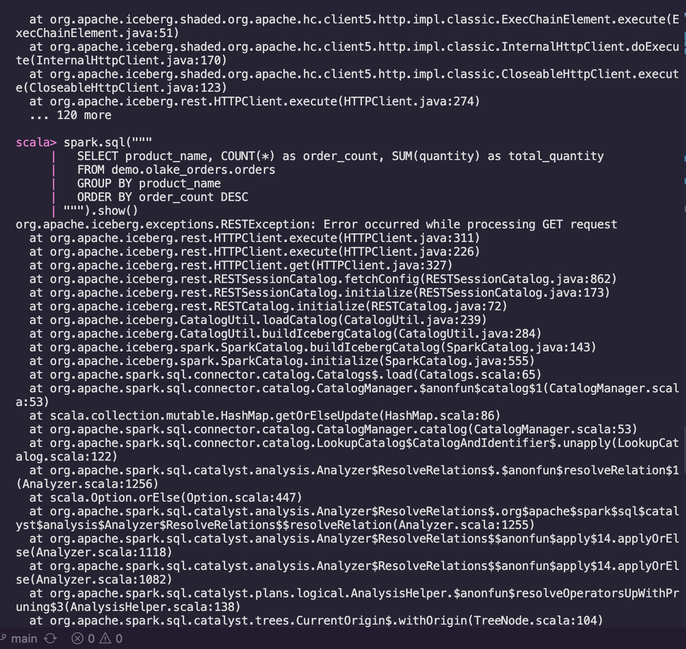
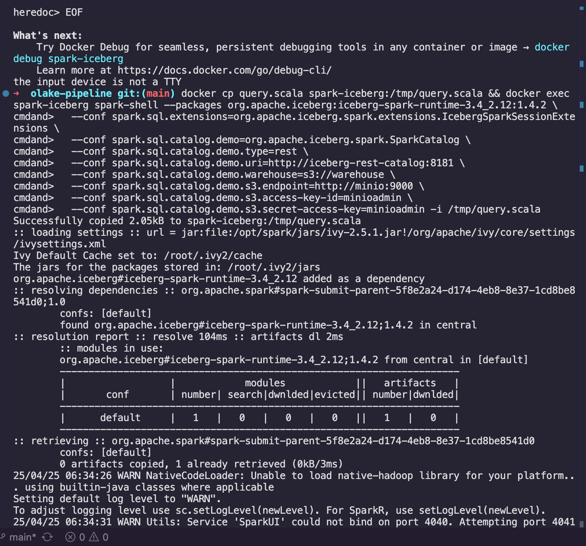

# OLake Pipeline Demo

This project demonstrates data synchronization from MySQL to Apache Iceberg using OLake, with querying capabilities via Apache Spark.

## Architecture
- MySQL: Source database containing orders data
- OLake: Data synchronization tool
- MinIO: S3-compatible object storage
- Apache Iceberg: Table format
- Apache Spark: Query engine

## Setup Instructions

### 1. Start the Infrastructure
```bash
docker-compose up -d
```
This starts:
- MySQL (port 3306)
- MinIO (port 9000, console on 9001)
- Iceberg REST Catalog (port 8181)

### 2. Data Synchronization
OLake has been configured to:
- Discover MySQL schema
- Sync data to Parquet format
- Current sync status: 41 records synced successfully

### 3. Query with Spark
To query the synced data using Spark SQL:

1. Start Spark shell with Iceberg dependencies:
```bash
spark-shell --packages org.apache.iceberg:iceberg-spark-runtime-3.4_2.12:1.4.2 \
            --conf spark.sql.extensions=org.apache.iceberg.spark.extensions.IcebergSparkSessionExtensions \
            --conf spark.sql.catalog.demo=org.apache.iceberg.spark.SparkCatalog \
            --conf spark.sql.catalog.demo.type=rest \
            --conf spark.sql.catalog.demo.uri=http://localhost:8181 \
            --conf spark.sql.catalog.demo.warehouse=s3://warehouse \
            --conf spark.sql.catalog.demo.s3.endpoint=http://localhost:9000 \
            --conf spark.sql.catalog.demo.s3.access-key-id=minioadmin \
            --conf spark.sql.catalog.demo.s3.secret-access-key=minioadmin
```

2. Example Spark SQL queries:
```scala
// Read the orders table
spark.sql("SELECT * FROM demo.olake_orders.orders").show()
```

### Query Results
Here are some example query results from our Spark SQL queries:

#### Records


#### Docker



#### All Orders Query


#### Orders by Product Query


#### Spark UI


## Challenges Faced
1. Data type mapping between MySQL and Iceberg
2. Configuring proper S3 credentials for MinIO access
3. Setting up correct Spark dependencies for Iceberg integration

## Suggested Improvements
1. Add data validation between source and target
2. Implement incremental updates
3. Add monitoring and alerting
4. Implement data quality checks
5. Add schema evolution handling
